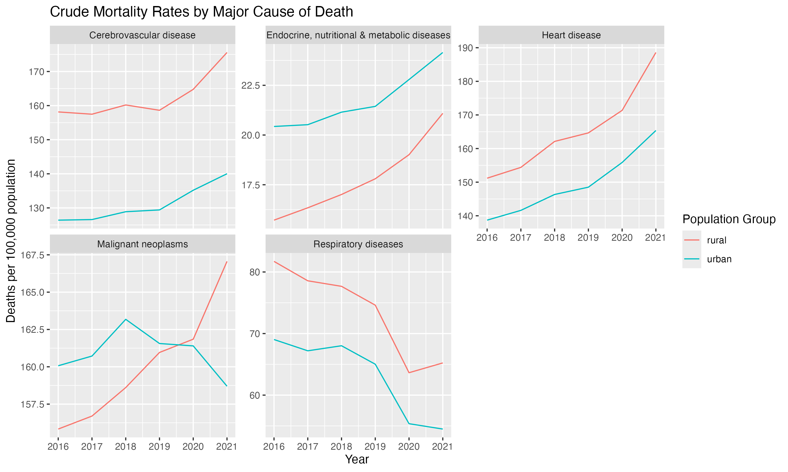

# China Mortality Analysis

## Overview

This project explores patterns in crude mortality rates for selected major causes of death among urban and rural residents in China from 2016 to 2021.

The analysis focuses on three questions:

1. How did mortality rates for major causes of death change over time?
2. How did urban-rural mortality gaps differ across causes of death?
3. How did mortality patterns differ by sex?

The project also includes reusable R functions for cleaning and restructuring statistical tables downloaded from the National Bureau of Statistics of China.

## Data

Source: National Bureau of Statistics of China

The analysis focuses on five major cause-of-death categories:

- Cerebrovascular disease
- Heart disease
- Malignant neoplasms
- Respiratory diseases
- Endocrine, nutritional and metabolic diseases

Mortality rates are reported as deaths per 100,000 population.

The original data were provided in separate urban and rural Excel tables and required cleaning before analysis.

## Data Cleaning

The raw statistical tables were transformed into tidy, analysis-ready data using `tidyverse` and several reusable custom functions.

The cleaning process included:

- Importing and reshaping irregular Excel tables
- Converting data from wide to long format
- Extracting information embedded in indicator names
- Separating population group, sex, cause of death, and units into individual variables
- Standardizing labels into consistent English categories
- Combining urban and rural datasets into a single tidy dataset

Custom helper functions were used to automate repeated cleaning tasks, including extracting categories from indicator strings and removing redundant text.

The final dataset contains variables such as:

- `year`
- `value`
- `cause`
- `population_group`
- `biological_sex`
- `unit`

## Analysis

### 1. Mortality trends by cause of death



Urban-rural patterns differed substantially across causes of death.

Crude mortality rates were generally higher in rural areas for cerebrovascular disease, heart disease, and respiratory diseases.

Endocrine, nutritional and metabolic disease mortality showed the opposite pattern, with higher mortality in urban areas throughout the observed period, although the difference appeared to narrow.

Malignant neoplasms showed the most unusual pattern. Urban mortality was initially higher than rural mortality, but the two rates gradually converged. By 2021, rural mortality had risen above urban mortality as the rural rate continued increasing while the urban rate declined slightly.

### 2. Urban-rural mortality gap


The urban-rural mortality gap did not show a single consistent direction across diseases.

For most causes of death, the gap fluctuated moderately without a clear sustained widening or narrowing trend during 2016-2021.

Malignant neoplasms were the clearest exception. The gap shifted steadily from positive to negative, confirming the crossover from higher urban mortality to higher rural mortality.

The gap analysis therefore largely reinforces the patterns visible in the mortality-rate trends rather than suggesting a common trend in urban-rural disparities across all diseases.

### 3. Mortality differences by sex


A clear and consistent sex disparity appeared across most major causes of death.

Male crude mortality rates remained higher than female rates for cerebrovascular disease, heart disease, malignant neoplasms, and respiratory diseases in both urban and rural populations.

The difference was particularly large for malignant neoplasms.

Endocrine, nutritional and metabolic diseases were the main exception. The male-female difference was much smaller and, for some population groups and years, female mortality was similar to or higher than male mortality.

## Key Findings

- Rural crude mortality rates were higher for three of the five selected major causes of death: cerebrovascular disease, heart disease, and respiratory diseases.
- Urban mortality remained higher for endocrine, nutritional and metabolic diseases.
- Malignant neoplasm mortality showed a notable urban-rural crossover during the study period.
- There was no common trend toward either widening or narrowing urban-rural mortality gaps across all diseases.
- Male crude mortality rates were consistently higher than female rates for most selected causes of death.
- The sex disparity was especially pronounced for malignant neoplasms.

## Limitations

The analysis uses crude mortality rates rather than age-standardized mortality rates.

As a result, differences between urban and rural populations or between males and females may partly reflect differences in population age structure in addition to differences in disease risk.

The data cover only six years, from 2016 to 2021. Changes observed during this period should therefore not be interpreted as long-term mortality trends.

This project is descriptive and does not establish causal explanations for the observed mortality patterns.

## Tools

- R
- tidyverse
- readxl
- ggplot2
- stringr
- tidyr
- dplyr

## Project Structure

```text
.
├── data_raw/
│   ├── urban_crude_mortality_by_cause.xlsx
│   └── rural_crude_mortality_by_cause.xlsx
├── data_clean/
│   └── death_mortality_clean.csv
├── figures/
│   ├── mortality_by_cause.png
│   ├── urban_rural_mortality_gap.png
│   └── mortality_by_sex.png
├── functions/
│   ├── nbs/
│   │   ├── clean_excel.R
│   │   └── clean_indicator_units.R
│   ├── x_paren_big.R
│   └── x_paren_small.R
├── china_mortality_analysis.R
└── README.md
```

## Possible Future Work

Future analysis could extend this project by:

- Using age-standardized mortality rates when available
- Examining individual cancer types rather than malignant neoplasms as a single category
- Investigating the factors associated with the urban-rural crossover in cancer mortality
- Comparing mortality patterns across a longer time period
- Incorporating demographic variables to better understand differences in crude mortality rates
